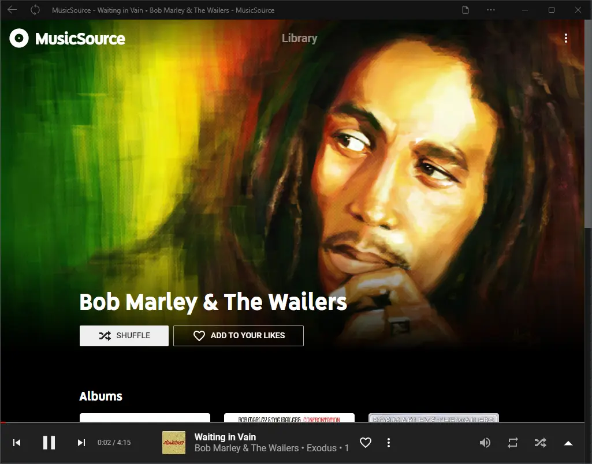

# MusicSource

A serverless clone of YouTube Music, for the desktop.

[https://music.creasource.app](https://music.creasource.app)

**Note:** MusicSource uses the [File System Access API](https://wicg.github.io/file-system-access/) to access your library files in read-only mode. Therefore, you will need a browser compatible with this API which is, as of May 2022, only implemented in some Chromium-based browsers like Chrome or Edge. You can check [caniuse](https://caniuse.com/native-filesystem-api) to know if your browser is compatible or head over to [MusicSource](https://music.creasource.app) and give it a try!

Notable libraries that MusicSource relies on:
* [music-metadata-browser](https://github.com/Borewit/music-metadata-browser)
* [audioMotion-analyzer](https://github.com/hvianna/audioMotion-analyzer)

## License

[MIT License](LICENSE)
